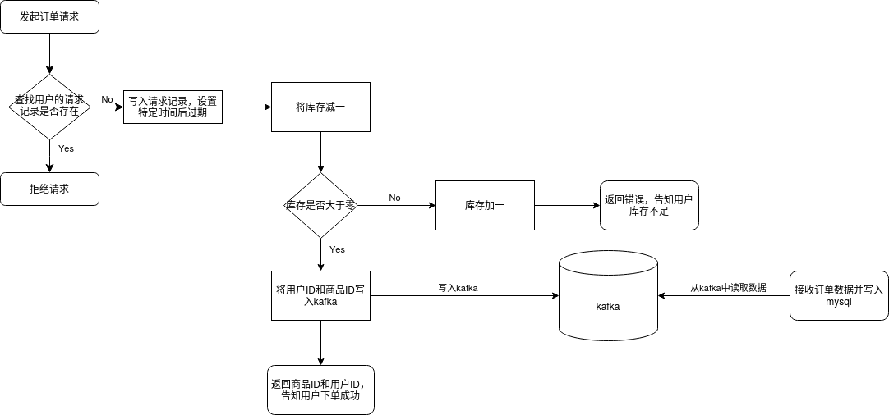

# 秒杀（闪购）系统

[中文](README_zh.md) | [English](README.md)



一个基于 Go 微服务、Redis 库存管理、Kafka 消息队列和 MySQL 订单持久化的分布式秒杀系统。

## 概述

本系统通过两个独立的微服务处理高并发秒杀场景：

1. **订单创建服务** (`order-create-service/`)：接收秒杀请求，通过 Redis 原子操作验证库存，实施速率限制，并将成功订单发布到 Kafka。
2. **订单存储服务** (`order-store-service/`)：从 Kafka 消费订单，并将其持久化到 MySQL 数据库。

## 架构

```
客户端 → [订单创建服务:8080] → Redis（库存/速率限制） → Kafka → [订单存储服务] → MySQL
```

### 核心特性
- **原子库存管理**：使用 Redis `DECR` 操作
- **速率限制**：通过 Redis TTL 键实现每个用户每秒 1 次请求
- **异步订单处理**：通过 Kafka 消息队列
- **读写分离**：独立的微服务设计
- **基于文件的日志记录**：用于错误跟踪

## 环境要求

- **Go 1.25.0+**（用于构建和运行服务）
- **Redis**（运行在 `localhost:6379`，无密码）
- **Kafka**（运行在 `localhost:9092`，主题 `write-order-to-mysql`）
- **MySQL**（运行在 `127.0.0.1:3306`，数据库 `SecKill`，用户 `root`，密码 `123456`）

## 快速开始

### 1. 克隆仓库
```bash
git clone <仓库地址>
cd seckill
```

### 2. 启动依赖服务
```bash
# 启动 Redis（假设已安装 Redis）
redis-server

# 启动 MySQL（确保数据库存在）
mysql -u root -p123456 -e "CREATE DATABASE IF NOT EXISTS SecKill;"

# 启动 Kafka（需要 Kafka 安装在 /opt/kafka_2.13-4.0.0/）
./kafka/start_kafka.sh

# 创建 Kafka 主题
/opt/kafka_2.13-4.0.0/bin/kafka-topics.sh --create --topic write-order-to-mysql --bootstrap-server localhost:9092 --partitions 1 --replication-factor 1
```

### 3. 构建并运行服务
```bash
# 终端 1：订单创建服务
cd order-create-service
go run ./cmd
# 服务启动于 http://localhost:8080

# 终端 2：订单存储服务
cd order-store-service
go run ./cmd
# 启动 Kafka 消费者和 MySQL 写入器
```

## API 文档

### 创建秒杀商品
**POST** `/seckill`

创建一个在特定时间窗口内有限库存的秒杀商品。

| 名称 (Name) | 类型 (Type) | 必选 (Required) | 说明 (Description) |
| :---------- | :---------- | :-------------- | :----------------- |
| product_id  | int         | 是 (Yes)        | 商品ID (Product ID) |
| start_time  | time        | 是 (Yes)        | 开始时间 (Start time) |
| end_time    | time        | 是 (Yes)        | 结束时间 (End time) |
| price       | float       | 是 (Yes)        | 商品价格 (Price) |
| stock       | int         | 是 (Yes)        | 库存 (Stock quantity) |

**请求示例：**
```json
{
  "product_id": 1001,
  "start_time": "2024-12-01T10:00:00Z",
  "end_time": "2024-12-01T12:00:00Z",
  "price": 99.99,
  "stock": 1000
}
```

**响应：**
- `200 OK`: `{"info": "添加秒杀成功"}`（秒杀商品创建成功）
- `400 Bad Request`: `{"info": "数据格式错误"}`（数据格式错误）
- `500 Internal Server Error`: `{"info": "添加秒杀失败"}`（创建秒杀商品失败）

### 下单秒杀商品
**GET** `/order`

尝试在秒杀期间购买商品。包含速率限制（每个用户每秒 1 次请求）和原子库存检查。

| 名称 (Name) | 位置 (Location) | 类型 (Type) | 必选 (Required) | 说明 (Description) |
| :---------- | :-------------- | :---------- | :-------------- | :----------------- |
| product_id  | query           | int         | 是 (Yes)        | 商品ID (Product ID) |
| user_id     | query           | int         | 是 (Yes)        | 用户ID (User ID) |

**请求示例：**
```
GET /order?product_id=1001&user_id=5001
```

**响应：**
- `200 OK`: `{"info": "订单创建成功", "order": {"product_id": 1001, "user_id": 5001}}`（订单创建成功）
- `400 Bad Request`: 各种错误信息（参数无效、秒杀未开始、库存不足等）
- `429 Too Many Requests`: `{"info": "请求过于频繁，稍后再试"}`（请求频率过高）
- `500 Internal Server Error`: `{"info": "服务器内部错误"}`（服务器内部错误）

### 订单状态查询（未实现）
**GET** `/order/search`

*注意：此端点已文档化，但当前代码库中尚未实现。*

| 名称 (Name) | 位置 (Location) | 类型 (Type) | 必选 (Required) | 说明 (Description) |
| :---------- | :-------------- | :---------- | :-------------- | :----------------- |
| user_id     | query           | int         | 是 (Yes)        | 用户ID (User ID) |

## 项目结构

```
seckill/
├── order-create-service/     # 秒杀订单创建服务
│   ├── cmd/main.go          # HTTP 服务器（Gin），端口 8080
│   ├── handlers/            # 请求处理器
│   ├── dao/db.go            # Redis 客户端配置
│   ├── model/model.go       # 商品和订单结构体
│   ├── logs/log.go          # 文件日志记录
│   └── go.mod               # Go 模块依赖
├── order-store-service/     # 订单持久化服务
│   ├── cmd/main.go          # Kafka 消费者和 MySQL 写入器
│   ├── handlers/            # Kafka 和 MySQL 处理器
│   ├── dao/db.go            # MySQL/GORM 配置
│   ├── model/model.go       # 带 GORM 标签的订单结构体
│   ├── logs/log.go          # 包含数据记录的文件日志
│   └── go.mod               # Go 模块依赖
├── kafka/                   # Kafka 管理脚本
│   ├── start_kafka.sh       # 启动 Kafka 服务器
│   └── stop_kafka.sh        # 停止 Kafka 服务器
├── docs/                    # 文档
│   └── 代码流程图.png       # 架构图（中文）
├── AGENTS.md                # 为本项目工作的 AI 助手指南
└── README.md                # 本文档（英文版）
```

## 开发指南

### 构建
```bash
# 构建两个服务
cd order-create-service && go build ./cmd
cd ../order-store-service && go build ./cmd
```

### 依赖
每个服务通过 `go.mod` 管理自己的依赖：
- **order-create-service**: Gin（HTTP）、go-redis（Redis）、sarama（Kafka 生产者）
- **order-store-service**: GORM（MySQL）、sarama（Kafka 消费者）

### 日志记录
- 两个服务都将日志写入各自目录下的 `app.log` 文件
- 错误通过 `logs.WriteLog(err)` 记录
- 订单存储服务包含 `WriteData(order)` 用于记录订单数据

## 配置

### 服务端点（硬编码）
- **Redis**: `localhost:6379`（无密码，数据库 0）
- **Kafka**: `localhost:9092`（主题：`write-order-to-mysql`）
- **MySQL**: `127.0.0.1:3306`（数据库：`SecKill`，用户：`root`，密码：`123456`）

*要更改这些值，请修改相应的 `dao/db.go` 和 `handlers/kafka_*.go` 文件。*

## 已知限制

1. **硬编码配置**：所有服务端点均为硬编码
2. **单 Kafka 分区**：消费者假定分区 0
3. **无优雅关机**：服务不处理 SIGTERM/SIGINT 信号
4. **无健康检查**：缺少就绪/存活端点
5. **中文错误信息**：错误响应仅使用中文
6. **缺少 `/order/search` 端点**：已文档化但未实现

## 贡献指南

1. Fork 本仓库
2. 创建功能分支
3. 遵循现有代码模式进行更改
4. 在 Redis、Kafka 和 MySQL 运行的情况下进行测试
5. 提交 Pull Request

## 许可证

[在此添加合适的许可证信息]